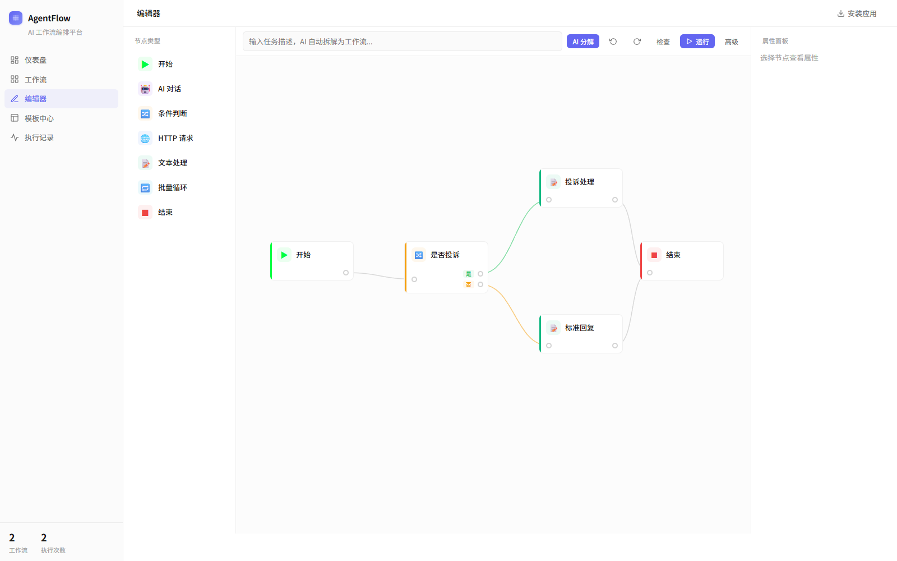
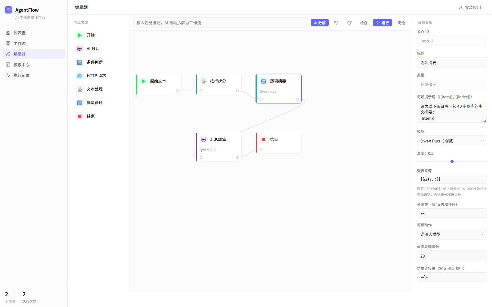
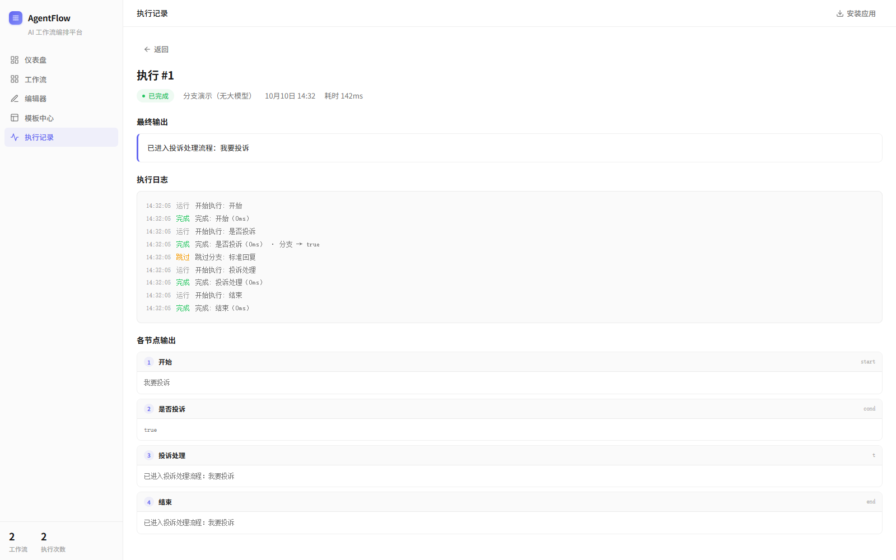

# AgentFlow - AI 工作流编排平台


**可视化 AI 工作流编排平台** — 拖拽节点、连线编排，让 AI 代理自动执行复杂任务

[English](#english) | [中文](#中文)



条件节点的两个出口分别画线，未选中的分支在执行日志里记为「跳过」。

---

## 🇨🇳 中文

### 📖 项目简介

AgentFlow 是一个基于可视化编排的 AI 工作流平台。用户通过拖拽节点、连线的方式构建自动化工作流，系统支持任务智能分解、多模型调度、条件分支、实时执行监控等功能。

**核心亮点：**
- 可视化工作流编辑器（拖拽 + 连线）
- AI 任务智能分解（复杂任务自动拆分为子任务）
- 多模型调度（qwen-turbo / qwen-plus / qwen-max）
- 条件分支真路由（「是 / 否」双出口，未选中的分支自动跳过）
- 批量循环节点（列表逐项调用大模型，并发执行后聚合）
- WebSocket 实时执行日志（含每个节点耗时与分支结果）
- 预设工作流模板

### 🏗️ 系统架构

```
┌─────────────────────────────────────────────────────────────┐
│                      Frontend  Web UI / Electron             │
│  ┌──────────────┐  ┌──────────────┐  ┌──────────────────┐  │
│  │ Node Palette │  │   Canvas     │  │  Properties      │  │
│  │  (Drag)      │─▶│  (SVG Edges) │  │  Panel           │  │
│  └──────────────┘  ──────────────┘  └──────────────────┘  │
└─────────────────────────────────────────────────────────────┘
                              │
                    RESTful API + WebSocket
                              │
┌─────────────────────────────────────────────────────────────┐
│                      Backend (FastAPI)                        │
│  ┌──────────────┐  ┌──────────────┐  ┌──────────────────┐  │
│  │  Workflow    │  │   Execution  │  │    LLM Client    │  │
│  │  Engine      │─▶│   Engine     │─▶│  (Multi-Model)   │  │
│  └──────────────┘  └──────────────┘  └──────────────────┘  │
│                          │                                    │
│                    ┌─────┴─────┐                              │
│                    │  SQLite   │                              │
│                    └───────────┘                              │
─────────────────────────────────────────────────────────────┘
```

### ✨ 功能特性

- **🎨 可视化编辑器** — 拖拽节点、SVG 连线、实时预览、Ctrl+Z 撤销
- **🤖 AI 任务分解** — 输入复杂任务，自动拆分为可执行子任务
- **🔀 条件分支** — 表达式求值（`==` `!=` `>` `>=` `<` `<=` `contains` `and` `or`），结果从「是 / 否」两个端口分流，未选中的分支在执行日志中记为「跳过」
- **🔁 批量循环** — 把上游列表（JSON 数组或按分隔符拆分的文本）逐项交给大模型，3 路并发、条数上限可调，结果聚合为一段
- **🌐 HTTP 请求** — GET / POST / PUT / PATCH / DELETE，支持自定义请求头与请求体，可配置 4xx/5xx 是否判定为失败
- **📝 文本处理** — 拼接、拆分为列表、查找替换
- **⚡ 多模型调度** — 不同节点使用不同模型（turbo/plus/max）
- **🧩 变量引用** — 节点配置中用 `{{input}}` 引用入口内容，用 `{{节点ID}}` 引用上游输出，循环节点内还可用 `{{item}}` / `{{index}}`
- **✅ 执行前校验** — 缺少开始/结束节点、连线指向幽灵节点、必填配置为空、节点不可达时直接返回中文原因，不会跑出一个半成品结果
- **📊 实时日志** — WebSocket 推送每个节点的起止、耗时与分支走向，断线自动降级为轮询
- **📋 工作流模板** — 预设 8 个模板，含条件分流与批量循环示例

**批量循环**：循环节点把上游列表逐项交给模型，配置面板可见列表来源、分隔符、并发上限。



**执行详情**：每个节点的输出、耗时与分支走向按顺序展开。



### 🧱 节点类型

| 节点 | 输入 | 输出 | 关键配置 |
|------|------|------|----------|
| ▶ 开始 | — | output | 工作流入口，接 `input` 变量 |
| 🤖 AI 对话 | input | output | `prompt` `model` `temperature` |
| 🔀 条件判断 | input | true / false | `condition` 表达式 |
| 🔁 批量循环 | input | output | `source` `separator` `action` `prompt` `max_items` `join` |
| 🌐 HTTP 请求 | input | output | `url` `method` `headers` `body` `fail_on_error` |
| 📝 文本处理 | input | output | `operation` `texts` `separator` `old` `new` |
| ⏹ 结束 | input | — | 输出最后一个业务节点的 result |

### 🛠️ 技术栈

| 组件 | 技术 |
|------|------|
| 后端框架 | FastAPI + Uvicorn |
| 数据库 | SQLite + SQLAlchemy |
| 大语言模型 | 阿里云百炼 (qwen-turbo/plus/max) |
| 实时通信 | WebSocket |
| 前端 | 原生 HTML/CSS/JS，无框架依赖 |
| 桌面端 | Electron 打包为 Windows 安装包 |
| 离线 | Service Worker + Web App Manifest |
| 容器化 | Dockerfile（非 root 运行 + 健康检查）+ docker-compose |

### 🚀 快速开始

#### 前置要求

- Python 3.11+
- 阿里云百炼 API Key（[获取地址](https://bailian.console.aliyun.com/)）

#### 本地运行

```bash
# 1. 克隆项目
git clone https://github.com/cappercclove/agentflow.git
cd agentflow

# 2. 创建虚拟环境
python -m venv venv
source venv/bin/activate  # Linux/Mac
# venv\Scripts\activate   # Windows

# 3. 安装依赖
pip install -r backend/requirements.txt

# 4. 配置环境变量
cp backend/.env.example backend/.env
# 编辑 backend/.env，填入你的百炼 API Key

# 5. 启动服务
cd backend
uvicorn main:app --host 0.0.0.0 --port 8000

# 6. 访问
# 前端: http://localhost:8000
# API文档: http://localhost:8000/docs
```

#### Docker 部署

```bash
# 1. 配置环境变量
export BAILIAN_API_KEY=your-api-key-here
export BAILIAN_BASE_URL=https://dashscope.aliyuncs.com/compatible-mode/v1

# 2. 构建并启动
docker-compose up -d

# 3. 访问 http://localhost:8001
```

### 📡 API 文档

启动服务后访问 `http://localhost:8000/docs` 查看交互式 API 文档。

**主要接口：**

| 方法 | 路径 | 说明 |
|------|------|------|
| GET | `/` | 前端页面 |
| GET | `/api/node-types` | 获取节点类型定义 |
| POST | `/api/workflows` | 创建工作流 |
| GET | `/api/workflows` | 获取工作流列表 |
| GET | `/api/workflows/{id}` | 获取工作流详情 |
| PUT | `/api/workflows/{id}` | 更新工作流 |
| DELETE | `/api/workflows/{id}` | 删除工作流 |
| POST | `/api/workflows/{id}/execute` | 执行工作流（先做结构校验，不通过返回 400 与中文原因） |
| POST | `/api/workflows/validate` | 只校验图结构，返回问题列表 |
| POST | `/api/nodes/execute` | 单节点试跑（调试用） |
| POST | `/api/decompose` | AI 任务分解 |
| GET | `/api/executions` | 获取执行记录 |
| GET | `/api/stats` | 获取统计信息 |
| WS | `/ws/execute/{id}` | WebSocket 实时日志 |

###  项目结构

```
agentflow/
├── backend/
│   ├── main.py                 # FastAPI 入口，REST + WebSocket 路由
│   ├── models.py               # SQLAlchemy 数据模型
│   ├── workflow_engine.py      # 执行引擎（条件求值、循环并发、图校验）
│   ├── llm_client.py           # 多模型 LLM 客户端
│   ├── node_types.py           # 节点类型定义
│   ├── tests/                  # pytest 用例
│   ├── requirements.txt
│   └── .env.example            # 环境变量模板
├── frontend/
│   ├── index.html              # 单页应用入口
│   ├── css/style.css
│   ├── js/
│   │   ├── app.js              # 视图切换与 API 调用
│   │   ├── editor.js           # 可视化编辑器（拖拽 + SVG 连线）
│   │   └── templates.js        # 内置工作流模板
│   ├── icons/                  # 应用图标
│   ├── manifest.json           # PWA 清单
│   ├── sw.js                   # Service Worker 离线缓存
│   └── offline.html            # 离线兜底页
├── electron.js                 # 桌面端主进程（拉起后端 + 创建窗口）
├── package.json                # Electron 打包配置
├── docs/
│   ├── screenshots/            # 界面截图
│   └── sample_workflow.json
├── Dockerfile
├── docker-compose.yml
├── LICENSE
└── README.md
```

### 🔮 未来计划

- [ ] 接入独立 Embedding 模型
- [ ] 添加 Redis 缓存层
- [ ] 支持子工作流调用
- [ ] 用户认证与多用户管理
- [ ] 工作流版本控制
- [ ] Nginx 反向代理 + HTTPS

---

## 🇬🇧 English

###  Introduction

AgentFlow is a visual AI workflow orchestration platform. Users build automation workflows by dragging nodes and connecting edges. The system supports intelligent task decomposition, multi-model scheduling, conditional branching, and real-time execution monitoring.

### ✨ Features

- **🎨 Visual Editor** — Drag-and-drop nodes, port-anchored SVG edges, undo/redo
- **🤖 AI Task Decomposition** — Automatically split complex tasks into subtasks
- **🔀 Real Branch Routing** — Expressions (`==` `!=` `>` `contains` `and` `or`) pick the 是/否 output port; the untaken branch is logged as skipped instead of executed
- **🔁 Batch Loop** — Feed a list (JSON array or split text) item by item into the model, 3-way concurrent, capped and joined back into one result
- **🌐 HTTP Requests** — GET / POST / PUT / PATCH / DELETE with headers and body, optional fail-on-4xx/5xx
- **📝 Text Processing** — Concatenate, split into a list, replace
- **🧩 Variable Binding** — `{{input}}` plus any upstream node id, and `{{item}}` / `{{index}}` inside a loop
- **✅ Pre-run Validation** — Missing start/end, dangling edges, empty required config or unreachable nodes are rejected with readable messages
- ** Real-time Logs** — WebSocket stream of per-node start/finish, duration and branch, with polling fallback
- **📋 Workflow Templates** — 8 pre-built templates including branching and batch-loop examples

###  Quick Start

```bash
git clone https://github.com/cappercclove/agentflow.git
cd agentflow
python -m venv venv && source venv/bin/activate
pip install -r backend/requirements.txt
cp backend/.env.example backend/.env  # Edit with your API Key
cd backend && uvicorn main:app --host 0.0.0.0 --port 8000
```

Visit `http://localhost:8000` for the web UI.

### ️ Tech Stack

Python · FastAPI · SQLite · WebSocket · Alibaba Cloud Bailian LLM · Electron desktop shell

### 📄 License

[MIT License](LICENSE)

⭐ If you find this project useful, consider giving it a star!
